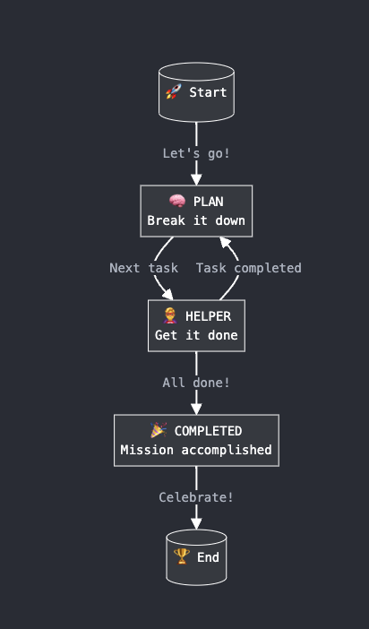

# Structured JSON is all you need

This project implements a multi-agent framework by modeling agents as Finite State Machines (FSM). [OpenAI's Structured JSON](https://platform.openai.com/docs/guides/structured-outputs/) offers a simpler way to create reliable agents without relying on complex beefy frameworks.

## Flow Diagram



## Overview

The project uses a Planner-Helper model where:

1. The Planner agent breaks down complex objectives into manageable tasks.
2. The Helper agent completes individual tasks.
3. An Orchestrator manages the state transitions and coordinates between agents.

You can add more agents like Planner & Helper. 

## Key Components

- `State`: Enum representing different states (PLAN, HELP, COMPLETED). Can add more states if needed.
- `Orchestrator`: Manages the overall flow and state transitions.
- `Agent`: Represents either a Planner or Helper, interacting with OpenAI's API. Can add more agents if needed.
- `Memory`: Optionally Maintain the current state, task list, and other relevant information for orchestrator. Memory is extensible to add arbitrary fields as needed.

## How to Start the Project

1. Clone the repository:

   ```
   git clone https://github.com/yourusername/structured-json-agents.git
   cd structured-json-agents
   ```

2. Install dependencies:

   ```
   poetry install
   ```

3. Set up your OpenAI API key:

   ```
   export OPENAI_API_KEY='your-api-key-here'
   ```

4. Run the main script:
   ```
   poetry run python main.py
   ```
